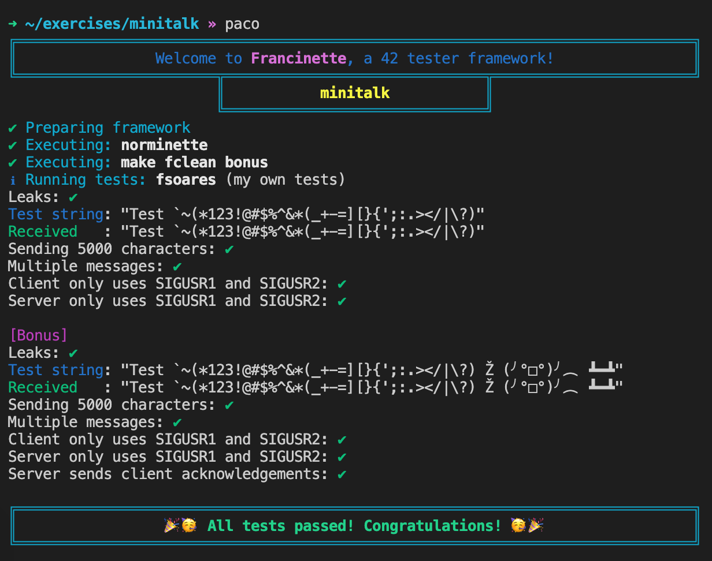

# Francinette

An easy to use testing framework for the 42 projects.

Use `francinette` or `paco` inside a project folder to run it.

Currently has tests for: `libft`, `ft_printf`, `get_next_line`, `minitalk` and `pipex`.

`Francinette` is only tested and confirmed to work on MacOS. Some testers may work on Linux,
but I give no guaranties of any test working or even compiling.

## Table of Contents
1. [Purpose](#purpose)
2. [Install](#install)
3. [Update](#update)
4. [Running](#Running)
5. [Uninstall](#uninstall)
6. [FAQ](#faq)
7. [Acknowledgments](#acknowledgments)


## Purpose:

This is designed to function as a kind of `moulinette` that you can execute in local.

That means that by executing `francinette` it will check `norminette`, compile the
code and execute the tests.

You can use it as a local test battery, to test your code.

#### Example execution:




## Install:
Francinette has an automatic installer.

Copy the line bellow to your console and execute it. It will automatically download the repo,
create the necessary folders and alias, and install a python virtual environment dedicated to
running this tool.

In linux it will also download and install the necessary packages for it to run. It needs
admin permission to do that.

```
bash -c "$(curl -fsSL https://raw.github.com/xicodomingues/francinette/master/bin/install.sh)"
```

The francinette folder will be under your `$HOME` directory (`/Users/<your_username>/`)


## Update:
Normally francinette will prompt you when there is a new version, and you can then update it.

You can also force it from francinette itself:

```
~ $> francinette -u              # Forces francinette to update
```

If the above does not work you can also execute the command bellow:

```
bash -c "$(curl -fsSL https://raw.github.com/xicodomingues/francinette/master/bin/update.sh)"
```


## Running:

If you are on a root of a project, `francinette` should be able to tell which project
it is and execute the corresponding tests.

You can also use the shorter version of the command: `paco`

To see all the available options execute `paco -h`

```
/C00 $> francinette                  # Execute the tests for C00

/C00/ex00 $> francinette             # Execute only the tests for ex00 in C00

/libft $> francinette                # Execute the tests for libft

~ $> francinette -h                  # Shows the help message

libft $> paco memset isalpha memcpy  # Executes only the specified tests
```

The name of the folder is not important. What is important is that you have a `Makefile`
that contains the name of the project (for example `libft`), or the expected delivery files. 
If there is no `Makefile` or delivery files are not present `francinette` will not know 
what project to execute.

```
~ $> francinette git@repo42.com/intra-uuid-234
```

This command clones the git repository present in `git@repo42.com/intra-uuid-234` into the
current folder and executes the corresponding tests

All the files are copied to the folder `~/francinette/temp/<project>`. In here is where the
norminette is checked, the code compiled and the tests executed. Normally you do not need to
access this directory for anything. But if you run into unexpected problems, this is where
the magic happens.

Log files can be found in: `~/francinette/logs`


## Uninstall

To uninstall `francinette` delete the `francinette` folder. It should be located under your
`$HOME` directory (`/Users/<your_username>/` or `/home/<your_username>/`)

You also need to remove the automatically created aliases. For that open your `~/.zshrc` 
file and delete the lines:

```
alias francinette="$HOME"/francinette/tester.sh
alias paco="$HOME"/francinette/tester.sh
```

## FAQ

If you have any questions I am probably in the barcelona cluster. Also, you can reach me on
slack under `fsoares-`

#### I'm more advanced than the tests you have available. When are you adding more tests?

When I reach that exercise or project. You can also add them. For that you need to create a
`ProjectTester.py` file. and change the function `guess_project` in `main.py` to recognize
the project.

#### This test that you put up is incorrect!

Please contact me on slack (under `fsoares-`), or create a new github issue,  indicating for
what exercise which test fails, and a description of what you think is wrong. You can also
try to fix it and create a pull request for that change!

## Troubleshooting

#### I've installed francinette, but when I try to execute it I get the message: `command not found: francinette`

In the install script I try to set two alias to for `francinette`: `francinette` and `paco`. 
If you are in MacOS I do that by adding two lines to the `.zshrc` file, and to `.bashrc` in 
linux. If by some chance you are using other shell, or for some other reason it does not work, 
You can try to set the aliases yourself, by adding:

```
alias francinette="$HOME"/francinette/tester.sh
alias paco="$HOME"/francinette/tester.sh
```

Now it should work. If it does not, don't be afraid to contact me.

## Acknowledgments

* To 42 for providing me this opportunity
* To [Tripouille](https://github.com/Tripouille) for [libftTester](https://github.com/Tripouille/libftTester), [gnlTester](https://github.com/Tripouille/gnlTester) and [printfTester](https://github.com/Tripouille/printfTester)
* To [jtoty](https://github.com/jtoty) and [y3ll0w42](https://github.com/y3ll0w42) for [libft-war-machine](https://github.com/y3ll0w42/libft-war-machine)
* To [alelievr](https://github.com/alelievr) for [libft-unit-test](https://github.com/alelievr/libft-unit-test) and [printf-unit-test](https://github.com/alelievr/printf-unit-test)
* To [cacharle](https://github.com/cacharle) for [ft_printf_test](https://github.com/cacharle/ft_printf_test)
* To [ombhd](https://github.com/ombhd) for [Cleaner_42](https://github.com/ombhd/Cleaner_42)
* To [arsalas](https://github.com/arsalas) for the help in the minitalk tester
* To [vfurmane](https://github.com/vfurmane) for [pipex-tester](https://github.com/vfurmane/pipex-tester)
* To [gmarcha](https://github.com/gmarcha) for [pipexMedic](https://github.com/gmarcha/pipexMedic)
